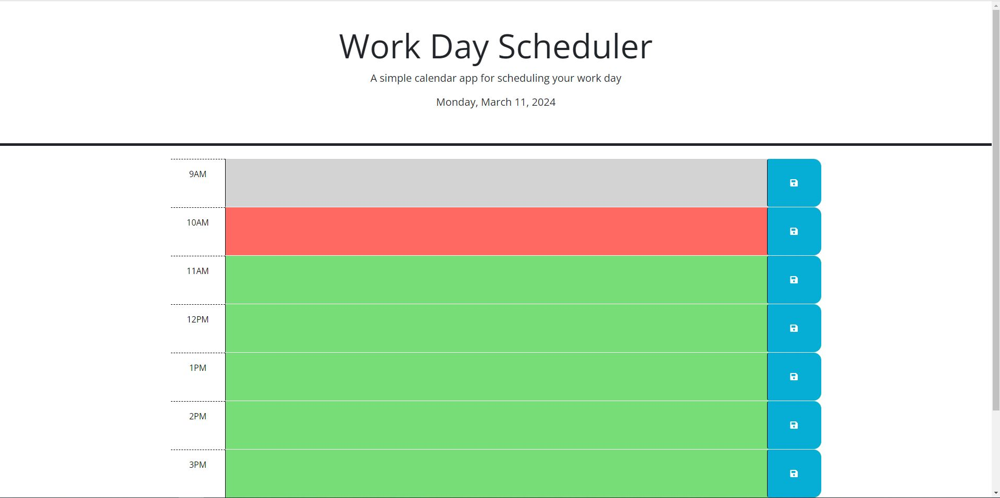

# Challenge 2

## Description

For this challenge, we will be modifying starter code to create a functioning Work Day Scheduler. Within this scheduler, you will be able to
select time blocks and add events to it. These events will be saved to local storage so that when you refresh the page, the event will be saved.

## User Story

AS AN employee with a busy schedule
I WANT to add important events to a daily planner
SO THAT I can manage my time effectively

## Acceptance Criteria

GIVEN I am using a daily planner to create a schedule
WHEN I open the planner
THEN the current day is displayed at the top of the calendar
WHEN I scroll down
THEN I am presented with timeblocks for standard business hours of 9am&ndash;5pm
WHEN I view the timeblocks for that day
THEN each timeblock is color coded to indicate whether it is in the past, present, or future
WHEN I click into a timeblock
THEN I can enter an event
WHEN I click the save button for that timeblock
THEN the text for that event is saved in local storage
WHEN I refresh the page
THEN the saved events persist

## Mock Up

The Work Day Scheduler should look like this. The timeblocks will be colored to represent past, present, and future!

[Take a look!](https://ryanhuynh006.github.io/Work-Day-Scheduler/)

## Conclusion

We have created a simple Work Day Scheduler to add important events within a busy schedule. This allows us to manage our time more effectively!